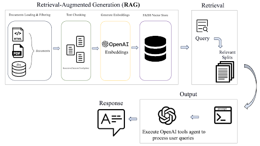

# Portfolio
---
## Data Science

### Predictive Modeling for Stock Options Pricing 

This project focuses on optimizing the valuation and pricing of stock options using advanced statistical and machine learning methods. The goal is to develop models that can accurately predict option values and classify them according to the Black-Scholes model. We utilized a dataset of 5,000 data points, employing various features such as stock price (S), strike price (K), time to expiration (τ), and risk-free rate (r). Through feature engineering, additional predictors were created, including moneyness (S/K), intrinsic value, and others, to enhance model performance.

The project approached the problem from two angles:

For both approaches, we implemented and compared multiple models, including Lasso, Ridge, Linear Regression, Decision Tree, Random Forest, Gradient Boosting, and XGBoost. Using the best parameters from GridSearch, we tuned hyperparameters for optimal performance. Ultimately, XGBoost stood out as the best model, achieving the highest R-squared value for regression and the lowest classification error.
By integrating machine learning, our approach provides a more flexible and precise method for predicting option values, offering significant improvements over traditional valuation techniques. This work provides valuable insights for financial institutions and traders, offering a more nuanced and potentially more accurate approach to option pricing and risk assessment in the dynamic world of financial markets.

---
### Unveiling the Secrets of Spotify Songs’ Popularity

The music industry is a lucrative sector within the entertainment industry, generating billions of dollars annually. **With 114,000 Spotify tracks over a range of 125 different genres**, there is immense revenue potential to utilize business analytics to help music producers adapt to this evolving landscape, understand consumer preferences through track popularity, guide in the song-making process, enhance the overall listening experience for consumers, and ultimately increase customer loyalty and subscription.

#### Interesting findings:
- **Cluster 0** represents the popularity of Pop-films. The songs in this genre tend to be moderately popular when they have lower ‘danceability’ and ‘tempo’ and a more positive or happy emotional tone.
- **Cluster 1** represents the popularity of K-pop. Since ‘valence’ and ‘loudness’ have positive values, it indicates that songs in K-pop should have higher loudness and a generally positive mood.
- **Cluster 2** represents the popularity of Chill. Negative ‘tempo’ suggests a more relaxed or laid-back feel, whereas positive ‘danceability’ indicates a balanced level of rhythm suitable for dancing. 
- **Cluster 3** represents the popularity of Pop. Songs in this genre are relatively popular when the tracks are less explicit, less danceable and convey a less positive mood. Pop songs tend to be louder to attract listeners. 
- **Cluster 4** represents the popularity of Hip-hop. It is pretty expected that Hip-hop songs are likely to be more popular when they have a strong rhythm and cheerful mood, creating a lively feel when combined with high danceability. However, it’s interesting to note that songs in this genre should contain fewer explicit lyrics and fall within a moderate tempo range.

---

## Natural Language Processing

### Yelp Restaurant Reviews: Sentiment Analysis and Topic Modeling

The project analyzed Yelp reviews of California restaurants using advanced text analytics techniques, including text preprocessing, NLTK's Sentiment Intensity Analyzer, Latent Dirichlet Allocation (LDA) for topic modeling, and linear regression to predict ratings based on sentiment scores. It processed 168,000 reviews from 588 restaurants by tokenizing, normalizing, and stemming text, removing irrelevant characters and stop words.

The LDA model achieved maximum coherence at 18 topics, which were grouped and hand-labeled into four meaningful categories, with 'service' emerging as the predominant topic (42%) and, along with 'food', showing the highest correlation with star ratings.

Recommendations: Implementing a "Yelp Rating Breakdown" and “Summary of Review” feature to provide detailed insights into specific aspects of ratings, helping restaurants improve their services, strategic marketing, and competitive edges and customers make informed decisions, personalized choices, and trend identification in restaurant performance over time. Overall, this feature benefits:
- **Improved User Experience:** Both businesses and customers benefit from more organized, accessible information.
- **Increased Platform Value:** These features could make Yelp more valuable and user-friendly, potentially increasing user engagement and retention.
- **Data Transparency:** Provides a clearer, more nuanced picture of customer sentiment beyond just an overall star rating.

---

## Generative AI/LLM

### Interactive AI Chatbot Development

**TL;DR:** This project showcases the development of an AI-driven chatbot and workflow automation system using various technologies and frameworks. It leverages OpenAI's language models, Streamlit for the user interface, LangChain for creating AI agents and tools, and integrates with AWS services like DynamoDB and SNS. The project involves creating a chatbot, implementing vector-based document retrieval, and developing an end-to-end workflow that processes information about dinosaur transportation, checks weather conditions, and sends status updates via email and text messages. The system demonstrates the power of combining LLMs with custom tools and databases to create a sophisticated, context-aware application capable of complex decision-making and communication tasks.

